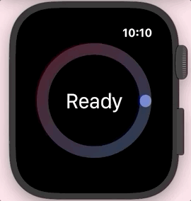

# CountdownRing

An animated countdown ring similar to the one used in Apple Workouts on watchOS.



## A simple countdown ring
The ring will expand to fill the height of its parent. Its width will equal its height. All we have to do is create the countdown ring and pass in the colors for the gradient.

```swift
struct ContentView: View {
    
	var body: some View {
		CountdownRing(colors: [.green, .blue])
	}

}
```

## Show a different view upon completion

```swift
struct ContentView: View {
    
	/// Use a state variable to track the progress of the countdown. We'll pass this 
	/// to the countdown ring as a binding.
	@State var countdownIsFinished = false
	
	var body: some View {
		VStack {
			/// Show the ring or the completion view based on the state of the `isFinished` variable
			if countdownIsFinished {
				/// Show "done" when the countdown is finished
				Text("The countdown is done!")
					/// We could also play a haptic at the end of the countdown.
					.onAppear {
						/// In this case we're using `start` to signify the start of the workout.
						WKInterfaceDevice.current().play(.start)
				}
			} else {
				/// Show the countdown ring when `isFinished` is false. It will animate automatically 
				/// when it appears.
				CountdownRing(
					isFinished: $countdownIsFinished, /// pass in the `isFinished` binding
					colors: [.pink, .orange] /// set the colors for the gradient
				)
			}
		}
	}
}
```

